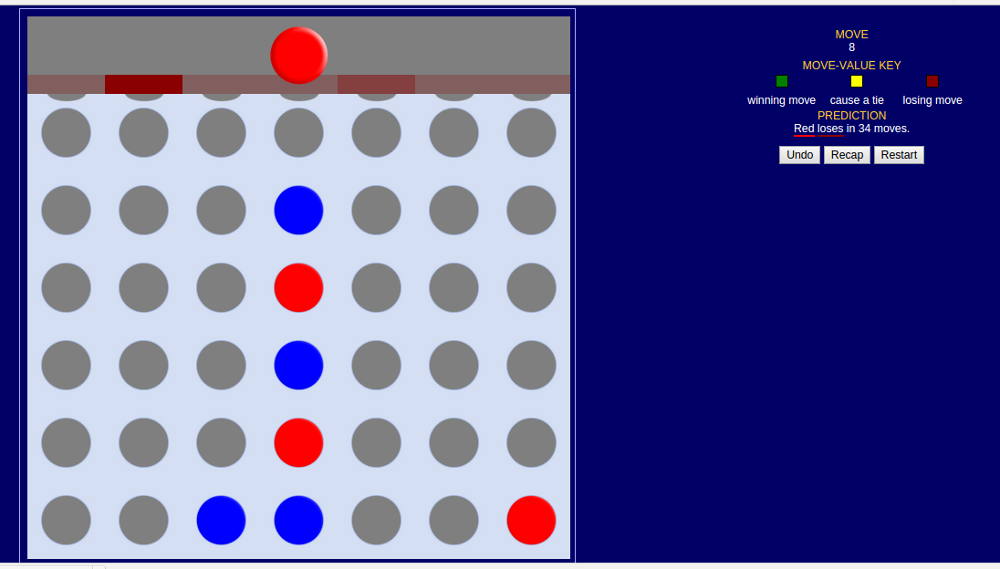

A training tool for the Connect 4 game, based on the one created by the UC Berkeley GamesCrafters team (http://gamescrafters.berkeley.edu/). I have removed the config options screen and made a couple of minor additions, for example adding a move counter, a loading/spinner image for when the move values are being fetched over the wire, and an "undo move" button to make it easier to analyse different paths through a game. 

The original can be found at http://cloud.cs.berkeley.edu:8090/gcweb/ui/game.jsp?game=connect4. My version can be seen in action at http://michaelfitzmaurice.com/connect4/connect4-trainer.html.
